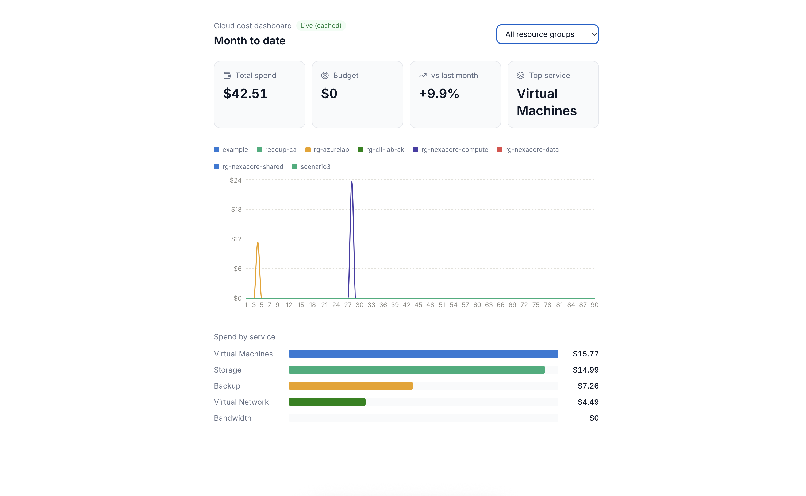
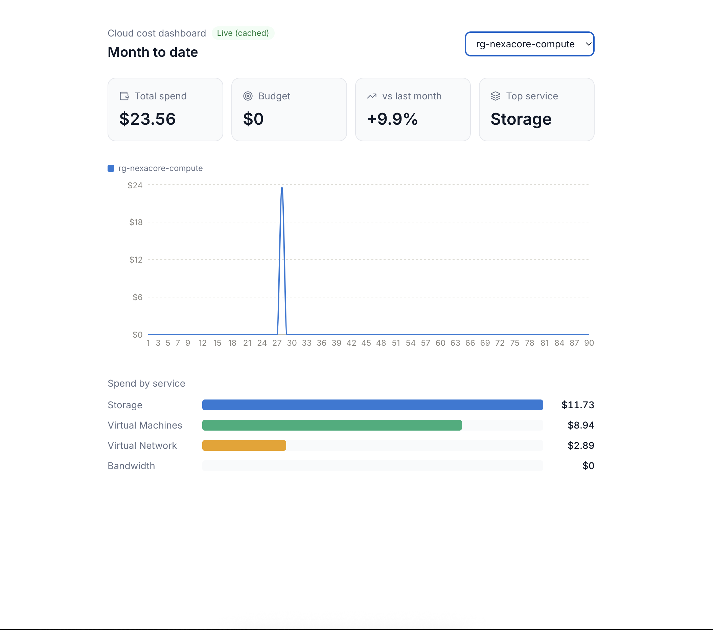

# Cloud Cost Dashboard

**🔗 Live demo:** [cloud-cost-dashboard-nine.vercel.app](https://cloud-cost-dashboard-nine.vercel.app)
**⚙️ Backend health check:** [cloud-cost-dashboard-dpaj.onrender.com/health](https://cloud-cost-dashboard-dpaj.onrender.com/health)




> Note: the backend runs on Render's free tier, which spins down after
> inactivity — the first request after a period of idleness may take
> 30-60 seconds to wake up. Subsequent requests are fast.

A full-stack cost visibility tool: a React dashboard on the frontend, backed
by a small Express proxy that authenticates to Azure with a read-only
service principal and pulls real Cost Management data.

Falls back to structured mock data automatically if the backend isn't
running or Azure isn't configured yet, so the UI is always demoable —
useful in interviews where you may not want to expose a live Azure
subscription.


## Architecture

```
┌─────────────┐      GET /api/costs       ┌──────────────┐      OAuth + REST      ┌──────────────────────────┐
│  React app  │ ────────────────────────▶ │ Express proxy │ ─────────────────────▶ │ Azure Cost Management API │
│ (Vite, :5173)│ ◀──────────────────────── │   (:4000)     │ ◀───────────────────── │  (management.azure.com)   │
└─────────────┘      cost data JSON        └──────────────┘      cost data JSON     └──────────────────────────┘
```

The frontend never talks to Azure directly, and never sees the Azure client
secret — only the backend holds credentials, and it exposes a read-only,
already-aggregated JSON endpoint.

## Stack

- **Frontend:** React 18, Vite, Tailwind CSS, Recharts, lucide-react
- **Backend:** Node, Express, OAuth2 client-credentials flow, in-memory caching

## Getting started

### 1. Frontend (works standalone with mock data)

```bash
npm install
npm run dev
```

Open `http://localhost:5173`. Without the backend running, it'll show a
"Mock data" badge and use the built-in sample data.

### 2. Backend (optional — enables real Azure data)

See **[backend/README.md](./backend/README.md)** for full setup, including
how to create the Azure service principal. Short version:

```bash
cd backend
cp .env.example .env   # fill in your Azure credentials
npm install
npm run dev
```

Once both are running, the dashboard badge switches to "Live" and the
numbers come straight from your Azure subscription.

## Project structure

```
src/
  App.jsx                    # Layout, filter state, aggregation logic
  components/
    MetricCard.jsx           # Summary stat card (total, budget, delta, top service)
    CostTrendChart.jsx       # Spend trend, recharts LineChart
    ServiceBreakdown.jsx     # Horizontal bar breakdown by Azure service
  data/
    mockData.js              # Mock data shaped like the Azure Cost Management API
    costApi.js                # Tries the live backend, falls back to mock data

backend/
  src/
    server.js                # Express entrypoint
    routes/costs.js          # GET /api/costs, with 15-minute caching
    services/azureAuth.js    # OAuth client-credentials token exchange
    services/costManagement.js # Azure Cost Management query + response shaping
  .env.example
  README.md                  # Azure service principal setup walkthrough
```

## Security model

- The Azure service principal is granted **Cost Management Reader** only —
  read access to billing data, no ability to modify any resource.
- The client secret lives in `backend/.env` (gitignored), never in the
  frontend bundle.
- Cost data is cached server-side for 15 minutes to stay under Azure's API
  rate limits.

## Ideas for further iteration

- Date-range picker instead of a fixed month
- CSV export of the current filtered view
- Cost-anomaly flag (e.g. highlight a resource group if week-over-week
  spend jumps more than 20%)
- Deploy the backend (Render/Railway/Azure Functions) and frontend
  (Vercel/Netlify) for a live demo link
